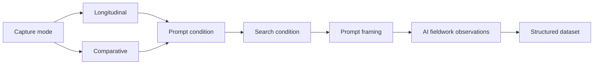

# AI Source Scraper

Capture every cited web source — with metadata — from the source/activity panels of **Claude, Gemini, and ChatGPT**, for longitudinal source-recurrence analysis (DMI26, *Agentic AI on the Web*). (YT video demo: https://youtu.be/RKFm4QOyR7E) **Use Google Chrome**

## Install — browser extension (recommended)

The scraper ships as a standalone browser extension: same engine, same floating panel, no third-party manager needed. Download both packages from the latest release. (Chrome Web Store and Firefox Add-ons listings are in review — one-click install links will be added here once approved.)

Thanks to Bernhard Rieder for the packaging suggestion 🦊

## No-install option — console version

Two console builds, no install required. Paste into the browser DevTools console
(F12 → Console, or on Mac **Option+Cmd+J**); Chrome asks you to type `allow pasting`
once.

**`ai-source-scraper-console.js`** — one-shot. Auto-scrolls the source panel, then
downloads CSV + JSON for the current response. Best for a quick, single capture.

**`ai-source-scraper-console-buffered.js`** — longitudinal build (v1.2). Paste **once**,
then capture as many prompts as you like in one thread; every scan appends to a buffer,
and you download a single merged CSV/JSON at the end. Ideal for prompting the same thread
over time. The buffer is saved to `localStorage`, so an accidental reload doesn't lose the
round.

```js
// paste the buffered script once, then per prompt (Sources panel open):
aiSourceScraper.scan('medium_p0_warm')      // label = file_id
aiSourceScraper.scan('medium_m1_warm')      // appends; repeat per prompt
// end of thread:
aiSourceScraper.csv(); aiSourceScraper.json(); aiSourceScraper.clear()
```

The label you pass is stored as `file_id` and, when it follows
`{topic}_{prompt_id}_{thread_state}` (e.g. `medium_m1_warm`), is auto-split into the
`topic`, `prompt_id`, and `thread_state` columns. Date and platform are captured
automatically, so you don't type them. A second argument becomes a free-text `note`:
`aiSourceScraper.scan('politics-en_m2_warm', 'panel slow to load')`.

---

## Output schema — additional columns (buffered console build, v1.2)

| column | meaning |
|---|---|
| `file_id` | the label passed to the scan — your join key across CSV, chat export, screenshot, and notes |
| `topic` | auto-split from `file_id` |
| `prompt_id` | auto-split from `file_id` (e.g. `p0`, `m1`…) |
| `thread_state` | auto-split from `file_id` (`warm` / `cold`) |
| `capture_date` | date of the scan (from `capture_timestamp`) |
| `note` | optional free-text observation (2nd argument to `scan`) |

These are additive: rows from the extension/userscript simply leave them blank, so all
outputs merge cleanly.

## Alternative — Tampermonkey userscript

**`ai-source-scraper.user.js`** — for those who already use [Tampermonkey](https://www.tampermonkey.net/) or Violentmonkey: dashboard → **+ New** → paste the file → save. Behaviour is identical to the extension (it's the same engine); the extension is simply the recommended route since it removes the dependency.

## Use it in 4 steps

1. Open a Claude / Gemini / ChatGPT response that searched the web.
2. **Open the Sources / Activity panel** so the list is on screen (it doesn't need to be scrolled — the tool does that).
3. Run it — click **Scan sources** in the panel (extension/userscript), or paste the console version. It scrolls the panel for a few seconds; watch the count climb. **Let it finish.**
4. Download CSV / JSON.

For the current extension workflow, see the **[Quick Start](docs/QUICKSTART.md)**.

## Research designs

AI Source Scraper supports **longitudinal** and **comparative** research designs while recording the methodological conditions of each capture.



**Longitudinal** captures ask how responses, sources, or interfaces change over time or across conversational sequences.

**Comparative** captures ask how outputs differ across deliberately varied research conditions.

> **Prompt condition**: Where does the prompt sit conversationally?  
> **Search condition**: Under what technical search condition was it run?  
> **Prompt framing**: How is the prompt epistemically positioned?

📖 **[Read the Research Design & Codebook](docs/RESEARCH-DESIGN.md)**

## Repository contents

- `README.md` — overview, purpose, usage, output schema and limitations.
- `docs/QUICKSTART.md` — step-by-step instructions for running the scraper.
- `docs/RESEARCH-DESIGN.md` — research designs, methodological variables, prompt-framing examples and codebook values.
- `extension/` — browser extension source (`manifest.json`, `content.js`); packaged builds are attached to each [release](https://github.com/jannajoceli/ai-source-scraper/releases/latest).
- `ai-source-scraper-console.js` — no-install browser console version.
- `ai-source-scraper.user.js` — Tampermonkey/Violentmonkey userscript (alternative to the extension).
- `assets/` — logo and icon files.
- `.gitignore` — ignores local exports and editor/OS clutter.
- `REPOSITORY_NOTES.md` — suggested repository description, topics and setup notes.

## Output schema

| column | meaning |
|---|---|
| `rank` | order in the list (proxy for position/prominence) |
| `capture_id` | one id per scan (extension/userscript) — separates captures in one file |
| `capture_timestamp` | ISO time of the scan |
| `platform` | claude / gemini / chatgpt |
| `page_url`, `page_title` | the conversation |
| `session_label` | your free-text note, e.g. the prompt (extension/userscript field) |
| `source_type` | `panel` (full activity list, has a description) vs `inline` (citation chip in the answer) |
| `url` | full URL exactly as shown — keeps tracking params, for provenance |
| `clean_url` | URL with `utm_*` and click-ID params (`fbclid`, `gclid`, …) stripped — **use this for grouping / recurrence** |
| `hostname`, `domain` | host, registrable domain |
| `title` | the source's headline as shown on the card |
| `description` | the card's snippet/description |
| `favicon` | favicon image URL |

`source_type` lets you compare **what was cited in the answer (`inline`) against everything consulted (`panel`)** — a direct read on selectivity. De-duplication keeps the richer card when a source appears both inline and in the panel, and merges `utm_*` query variants of the same URL.

## Console API

The extension and userscript expose `window.aiSourceScraper` with `.scan()`, `.buffer`, `.csv()`, `.json()`, `.clear()`, `.setLabel(s)` for driving captures from the console or chaining into other tooling.

## Tuning

`denyHosts` at the top of each script is the only exclusion list — deliberately tight, so `google.com` / `openai.com` / `anthropic.com` citations are kept (only their account/settings/support subdomains drop). Add a host there if UI links sneak in; remove one if a real citation is being dropped. In the extension, edit `extension/content.js` and reload the extension.

## Honest limitations

- It reads the rendered DOM, so the source panel must be **open**. If a scan returns 0, the panel almost certainly isn't open, or the list hadn't rendered yet.
- Auto-scroll works for the lazy lists these products use, but on a very long list (hundreds) give it the full few seconds; the count stops climbing when it's done.
- A strict Content-Security-Policy can block the Blob download; all versions fall back to copying the CSV to your clipboard (and the console version leaves rows in `window.__aiSources`).
- It captures the *displayed* source/activity layer, not the model's internal query fan-out — that isn't exposed in the DOM.
- These interfaces change often. The detection is structure-based (repeating link rows + scroll), not class-name-based, precisely so it survives redesigns; if a future layout breaks it, the `rowOf` / `findContainers` heuristics at the top are where to adjust.

## Acknowledgment
The code was developed with the assistance of Claude (Anthropic, 2026) through an iterative vibe-coding process.

## Full citation (APA 7, software)

Omena, J. J. (2026). AI Source Scraper (Version 1.2.0) [Computer software]. Zenodo. https://doi.org/10.5281/zenodo.20945556
```