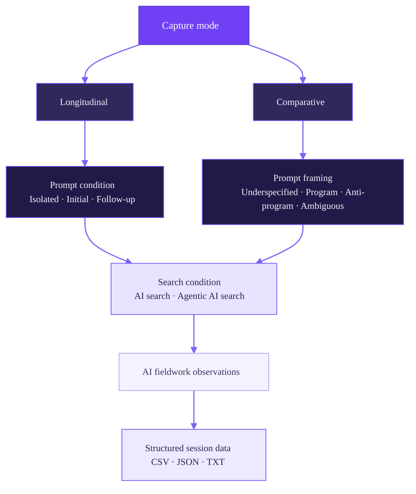

# Research Design & Codebook

AI Source Scraper is designed not only to collect cited web sources, but also to record the methodological conditions under which those sources were produced.

Each capture can therefore be read as both a source collection event and a documented research condition.

## Visual schema



The schema foregrounds the primary methodological distinction between the two research designs:

1. **Longitudinal** captures are organised through **Prompt condition**: Isolated, Initial, or Follow-up.
2. **Comparative** captures are organised through **Prompt framing**: Underspecified, Program, Anti-program, or Ambiguous.
3. **Search condition** is shared across both designs: AI search or Agentic AI search.

**AI fieldwork observations** are an optional annotation field that lets the researcher record what was noticed during data collection.

---

## Two research designs

The **Capture mode** toggle records which research design a capture belongs to. Both modes behave identically in the tool: scans accumulate into a session that can be exported whenever the researcher chooses, and both expose the same metadata fields.

The distinction exists to make the intended analytical relationship between captures explicit. It is written into every exported row as `capture_mode`, so merged files can later be filtered and regrouped by design.

| Capture mode | What it asks | Value |
|---|---|---|
| **Longitudinal** | How does the response, its sources, or the interface develop or change over time or across a conversational sequence? | `longitudinal` |
| **Comparative** | How do outputs differ across deliberately varied research conditions, such as different search conditions or prompt framings? | `comparative` |

---

## Research variables

The fields remain separate because they describe different dimensions of the capture.

> **Prompt condition**: Under what conversational condition was the prompt issued?  
> **Search condition**: Under what technical search condition was the response produced?  
> **Prompt framing**: How was the prompt epistemically positioned?

The same prompt framing can be tested under different search conditions, and the same search condition can be tested with different prompt conditions or framings.

## Prompt condition

`prompt_condition`

Prompt condition records the conversational condition under which the prompt is issued, especially its relationship to prior context.

| Option | What is happening? | Value | `thread_state` |
|---|---|---|---|
| **Isolated** | No prior conversational context; the chat receives no follow-ups. | `isolated` | `cold` |
| **Initial** | Opens a session or sequence that will receive planned follow-ups. | `initial` | `cold` |
| **Follow-up** | Issued within an ongoing conversation and inherits context from previous turns. | `follow_up` | `warm` |

`thread_state` keeps the legacy two-way `cold` / `warm` code for label-parsing compatibility. `prompt_condition` carries the more precise three-way distinction that cold/warm alone cannot.

Terminology follows the broader distinction between ad-hoc and conversational querying discussed by Radlinski and Craswell (2017) and Dalton, Xiong and Callan (2020).

---

## Search condition

`search_condition`

Search condition records the technical condition under which the response was generated.

| Search condition | Value |
|---|---|
| **AI search** | `ai_search` |
| **Agentic AI search** | `agentic_ai_search` |

Example: a researcher may issue the same or very similar prompt under AI search and then repeat it under Agentic AI search. The resulting sources, domains, outputs, and fieldwork observations can then be compared.

---

## Prompt framing

`prompt_framing`

Prompt framing records how the prompt is positioned epistemically. The interface label remains **Prompt framing**.

| Prompt framing | What is happening? | Value |
|---|---|---|
| **Underspecified** | The prompt does not strongly orient the model towards a particular position, perspective, or interpretation. The AI has greater freedom to determine what is relevant. | `underspecified` |
| **Program** | The prompt positively aligns with, supports, or advances a position, actor, claim, or perspective. | `program` |
| **Anti-program** | The prompt contests, challenges, or positions itself against a position, actor, claim, or perspective. | `anti_program` |
| **Ambiguous** | The prompt contains competing, unclear, or conflicting orientations, leaving more than one plausible interpretive direction. | `ambiguous` |

A useful methodological distinction:

> **Underspecified prompts leave positioning largely to the AI. Ambiguous prompts require the AI to negotiate between possible positions.**

### Examples

#### Underspecified

> What are the main issues surrounding this political debate?

The researcher does not explicitly indicate which position the AI should prioritise. This condition can help reveal which perspectives, sources, and interpretations the AI introduces by default.

#### Program

> Explain the arguments in favour of this political programme.

The prompt explicitly orients the AI towards a supportive position.

#### Anti-program

> Explain the strongest criticisms of this political programme.

The prompt explicitly orients the AI towards an oppositional or critical position.

#### Ambiguous

> Is this political programme a necessary reform or a threat to existing rights?

The prompt introduces competing interpretive possibilities. The AI must negotiate, balance, or privilege one or more positions.

---

## Naming your captures

Recommended labels follow:

`{topic}_{prompt_id}_{thread_state}`

The label is automatically split into `topic`, `prompt_id`, and `thread_state` columns.

| Segment | Pattern | Example |
|---|---|---|
| `topic` | Any text | `medium`, `dataviz` |
| `prompt_id` | `p0` or `m1`, `m2`... | `p0`, `m1` |
| `thread_state` | `cold` / `warm` | `cold` |

Examples:

- `medium_p0_cold`: isolated or initial prompt in a fresh thread
- `medium_p0_warm`: follow-up prompt in an ongoing thread

A leading platform token or 8-digit date token is accepted and ignored during label parsing because platform and date are captured automatically.

In the console-buffered build, pass the label explicitly:

```js
grab('medium_p0_cold')
```

---

## How the fields work together

A comparative capture might be recorded as:

```text
capture_mode: comparative
prompt_condition: isolated
thread_state: cold
search_condition: agentic_ai_search
prompt_framing: underspecified
session_label: medium_p0_cold
```

This makes it possible to compare captures without collapsing distinct methodological dimensions into a single label.

For example, changing from `ai_search` to `agentic_ai_search` changes the **search condition**. Changing from `underspecified` to `program` changes the **prompt framing**. Moving from an isolated prompt to a follow-up changes the **prompt condition**.

---

## Panel field order

The v1.3.1 interface follows this sequence:

**Capture mode** (`Longitudinal` default | `Comparative`)  
→ **Session label**  
→ **Prompt condition**  
→ **Search condition**  
→ **Prompt framing**  
→ **AI fieldwork observations**  
→ **Scan and add to session**  
→ session summary  
→ **Download all (CSV + JSON + TXT)**  
→ separate file downloads  
→ clear buffer  
→ citation footer

---

## Console-buffered command summary

```js
// Scan
grab('medium_p0_cold')

// Variables
grab.mode('comparative')
grab.promptCondition('initial')
grab.search('agentic_ai_search')
grab.framing('program')
grab.notes('what you observed...')

// Files
grab.csv()
grab.json()
grab.txt()
grab.all()

// Reset and status
grab.clear()
grab.status()
```

Accepted values:

```text
capture_mode:
'longitudinal' | 'comparative'

prompt_condition:
'isolated' | 'initial' | 'follow_up'

search_condition:
'ai_search' | 'agentic_ai_search'

prompt_framing:
'underspecified' | 'program' | 'anti_program' | 'ambiguous'
```

---

## Citation

Omena, J. J. (2026). *AI Source Scraper* [Computer software]. Zenodo. https://doi.org/10.5281/zenodo.20945556

Source: https://github.com/jannajoceli/ai-source-scraper